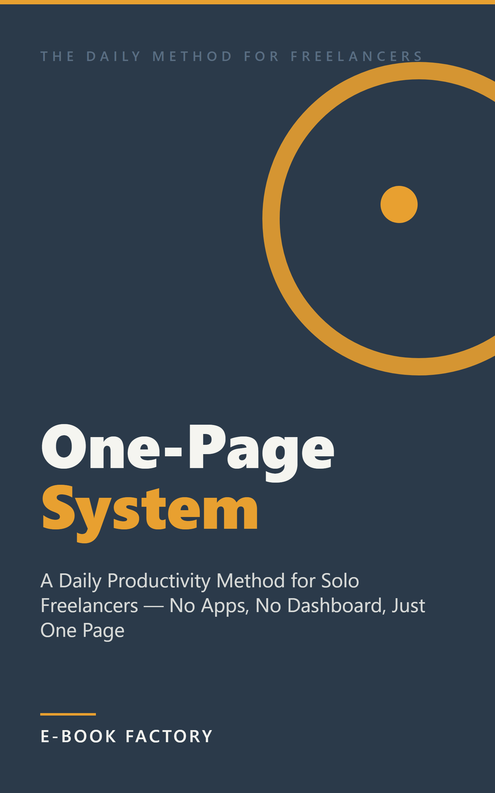

# Revisión humana — EB-000001



| Campo | Valor |
|---|---|
| Título | The One-Page System |
| Subtítulo | A Daily Productivity Method for Solo Freelancers — No Apps, No Dashboard, Just One Page |
| Autor | E-Book Factory |
| Idioma / Mercado | en-US / US |
| Versión | 1.0 |
| Páginas (PDF 6x9) | 21 |
| Formatos | EPUB, PDF |
| QC | **WARN** (auto: WARN, {'PASS': 23, 'WARN': 2}) |
| Riesgo | LOW  |
| Precio sugerido | 3.99 USD (ESTIMATE) — Short nonfiction guide (~6000 words) targeting a specific professional niche (solo freelancers). $3.99 sits in the sweet spot for impulse buys in the productivity subcategory: above the $0.99-$2.99 band that signals low-quality content, below the $5.99+ band that requires more perceived authority. Comparable niche productivity guides in Kindle US cluster around $2.99-$4.99. |
| Colecciones | - |

## Descripción

Most productivity advice was built for offices — places with start times, managers, and colleagues who notice if you disappear. Remove all of that, and the same advice stops working. Not because you're doing it wrong. Because it was never designed for a room with no walls.

The One-Page System is a different kind of guide. It gives solo freelancers the one thing they actually lose when they go independent: a lightweight structure for the day that takes five minutes to build and two minutes to close.

Each morning, you draw one page divided into four zones:

- Top Priorities: three things that would make today a win — chosen with a fast filter that separates urgent client work from the important-but-quiet tasks that actually grow your business.
- Time Blocks: a rough shape for the day, with one protected block for deep focus and a plan for the reactive hours so you're not re-deciding what to do every twenty minutes.
- Client Map: a one-glance list of every active client with a single status word — so you always know who's waiting for you and who's stalled, without opening your inbox.
- Day-Close Line: one sentence at the end of the day that marks work as done and tells you tomorrow's first task — so the workday has an ending instead of just fading into the evening.

No app. No subscription. No course. One page, redrawn fresh each morning — by hand or in a plain text file — in under five minutes.

This book is for freelance designers, writers, developers, consultants, and anyone else who works alone and wants a way to start the day knowing what matters — and to end it without work bleeding into everything else.

## Keywords

- freelance productivity system
- daily planning for freelancers
- time management solo worker
- work from home productivity
- freelancer daily schedule
- one page planner method
- productivity for self-employed

## Categorías

- Kindle Store > Kindle eBooks > Business & Money > Small Business & Entrepreneurship
- Kindle Store > Kindle eBooks > Self-Help > Time Management
- Kindle Store > Kindle eBooks > Business & Money > Business Culture > Motivation & Self-Improvement

## Warnings / puntos a revisar

- **WARN** CONTENT/length: 5045 palabras (objetivo 6000)
- **WARN** FORMAT/pdf_pages: 21 páginas (KDP print exige ≥24)

## Archivos

- cover: `design/cover.png`
- cover_jpg: `design/cover.jpg`
- epub: `build/EB-000001_the-one-page-system_v1.0.epub`
- pdf: `build/EB-000001_the-one-page-system_v1.0.pdf`
- Informe QC: `reports/qc_report.md`, `reports/qc_auto.md`
- Informe edición: `reports/editing_report.md`; fact-check: `reports/factcheck_report.md`

## Decisión

```
python factory.py approve EB-000001 --by <SOCIO> [--author "Pen Name"] [--notes "..."]
python factory.py request-changes EB-000001 --by <SOCIO> --restart-at EDIT --notes "qué cambiar"
python factory.py reject EB-000001 --by <SOCIO> --notes "motivo"
```
