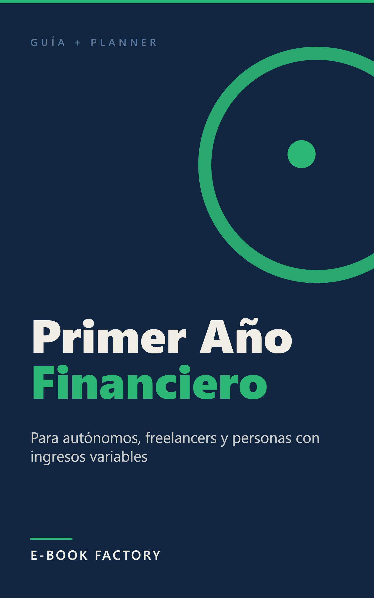

# Revisión humana — EB-000003



| Campo | Valor |
|---|---|
| Título | Tu Primer Año de Orden Financiero: Guía y Planner Completo |
| Subtítulo | Para autónomos, freelancers y personas con ingresos variables |
| Autor | E-Book Factory |
| Idioma / Mercado | es-ES / ES |
| Versión | 1.0 |
| Páginas (PDF 6x9) | 28 |
| Formatos | EPUB, PDF |
| QC | **HUMAN_REVIEW** (auto: HUMAN_REVIEW, {'PASS': 23, 'WARN': 1, 'HUMAN_REVIEW': 1}) |
| Riesgo | HIGH ['finanz', 'financ'] |
| Precio sugerido | 3.99 EUR (ESTIMATE) — La investigación sitúa el rango óptimo en 2,99–4,99 EUR para guías prácticas de finanzas personales en Kindle ES. 3,99 EUR es el punto medio que maximiza la compra impulsiva sin señalar precio de baja calidad. El formato guía + planner justifica estar en la mitad alta del rango frente a guías sin contenido práctico integrado. |
| Colecciones | - |

## Descripción

¿Cómo presupuestas cuando no sabes cuánto vas a cobrar el mes que viene? La mayoría de guías de finanzas personales están pensadas para asalariados con nómina fija. Este libro es para los demás: autónomos, freelancers y personas con ingresos que varían mes a mes que necesitan un sistema que funcione igual cuando entra mucho que cuando entra poco.

Tu Primer Año de Orden Financiero combina una guía práctica de hábitos financieros con un planner de 12 meses integrado. No es teoría: son hojas de trabajo listas para rellenar que te acompañan desde el diagnóstico inicial hasta el cierre del año.

Qué encontrarás:
- El método del presupuesto por porcentajes: cómo distribuir lo que entra, sea mucho o poco
- Cómo construir un fondo de emergencia adaptado a los ingresos irregulares
- La reserva fiscal explicada sin jerga: qué guardar cada mes para IRPF e IVA trimestral
- Cómo controlar los gastos sin pasar horas en hojas de cálculo
- Planner mensual de 12 meses: ingresos, gastos, balance y objetivos
- Los primeros pasos para empezar a ahorrar y fijar objetivos con un sueldo irregular

Este libro es para ti si:
- Eres autónomo o freelancer y los pagos trimestrales a Hacienda siempre te pillan sin liquidez
- Tus ingresos varían mes a mes y no tienes un sistema claro para gestionarlos
- Estás empezando y quieres construir buenos hábitos financieros desde el principio
- Buscas una guía práctica con hojas de trabajo, no un libro de teorías financieras

Nota: este libro tiene fines educativos y orientativos. No constituye asesoramiento financiero ni fiscal profesional. Para decisiones sobre tu situación concreta, consulta con un asesor cualificado.

## Keywords

- planner finanzas autónomos
- finanzas personales ingresos variables
- organizar dinero freelance
- reserva fiscal autónomos
- presupuesto autónomo mensual
- guía finanzas primer año
- control gastos ingresos irregulares

## Categorías

- Tienda Kindle > No Ficción > Economía y empresa > Finanzas personales
- Tienda Kindle > No Ficción > Economía y empresa > Pequeña empresa y emprendimiento
- Tienda Kindle > No Ficción > Autoayuda y superación personal > Desarrollo personal

## Warnings / puntos a revisar

- **WARN** LANGUAGE/spacing: 12 dobles espacios
- **HUMAN_REVIEW** RISK/sensitive_topic: Tema sensible: finanz, financ

## Archivos

- cover: `design/cover.png`
- cover_jpg: `design/cover.jpg`
- epub: `build/EB-000003_tu-primer-ano-de-orden-financiero-guia-y_v1.0.epub`
- pdf: `build/EB-000003_tu-primer-ano-de-orden-financiero-guia-y_v1.0.pdf`
- Informe QC: `reports/qc_report.md`, `reports/qc_auto.md`
- Informe edición: `reports/editing_report.md`; fact-check: `reports/factcheck_report.md`

## Decisión

```
python factory.py approve EB-000003 --by <SOCIO> [--author "Pen Name"] [--notes "..."]
python factory.py request-changes EB-000003 --by <SOCIO> --restart-at EDIT --notes "qué cambiar"
python factory.py reject EB-000003 --by <SOCIO> --notes "motivo"
```
