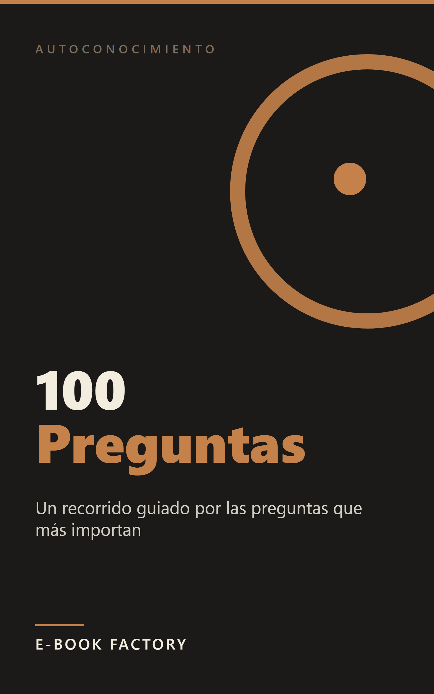

# Revisión humana — EB-000004



| Campo | Valor |
|---|---|
| Título | Diario de Autoconocimiento: 100 Preguntas para Conocerte y Reordenar tu Vida |
| Subtítulo | Un recorrido guiado por las preguntas que más importan |
| Autor | E-Book Factory |
| Idioma / Mercado | es-ES / ES |
| Versión | 1.0 |
| Páginas (PDF 6x9) | 43 |
| Formatos | EPUB, PDF |
| QC | **PASS** (auto: PASS, {'PASS': 24}) |
| Riesgo | LOW  |
| Precio sugerido | 3.99 EUR (ESTIMATE) — La investigación sitúa el rango óptimo en 2,99–4,99 EUR para esta categoría. 3,99 EUR es el punto medio que maximiza la compra impulsiva (accesible sin pensar) sin señalar precio de baja calidad. Los libros de journaling guiado en Kindle ES con formato similar rondan 3,49–4,99 EUR. En el extremo inferior del rango (2,99) el libro también funciona si se busca volumen. |
| Colecciones | - |

## Descripción

¿Alguna vez has terminado un año con la sensación de que no te conoces del todo? Sabes lo que haces, pero no siempre por qué. Sabes lo que quieres, en teoría, pero cuando alguien te pregunta de verdad, la respuesta no llega tan clara.

Este libro es un recorrido de cien preguntas. No son preguntas de autoayuda positiva que te dicen cómo debes sentirte. Son preguntas que abren — sobre quién eres cuando nadie te mira, sobre las relaciones que te construyen y las que te gastan, sobre lo que el trabajo te da y lo que te cuesta, sobre los patrones que se repiten, el pasado que te formó y el futuro que quieres elegir.

Qué necesitas para usarlo:
Un cuaderno y un boli. Una pregunta al día, cinco minutos. Cien días para construir el mapa de algo que ya estaba ahí.

Lo que encontrarás:
- 100 preguntas organizadas por área vital: identidad, relaciones, trabajo, emociones, pasado y futuro
- Contexto para cada pregunta: por qué importa y qué suele ocurrir cuando se responde de verdad
- Estructura que permite leerlo en orden o ir directamente al área que más te apremia ahora
- Tono cálido y directo, sin jerga psicológica ni respuestas sugeridas

Este libro es para ti si:
- Buscas algo más interactivo que un libro de autoayuda clásico
- Has intentado llevar un diario en blanco y lo dejaste porque no sabías qué escribir
- Estás en un momento de cambio o transición y quieres claridad, no consejos
- Quieres terminar el libro con algo escrito sobre ti mismo que no sabías al empezar

Este libro no es terapia ni la sustituye.

## Keywords

- journaling guiado español
- reflexión personal guiada
- desarrollo personal interactivo
- introspección adultos guía
- identidad propósito valores
- guía autoayuda reflexiva
- crecimiento personal libro

## Categorías

- Tienda Kindle > No Ficción > Autoayuda y superación personal > Desarrollo personal
- Tienda Kindle > No Ficción > Salud y bienestar > Bienestar mental y emocional
- Tienda Kindle > No Ficción > Autoayuda y superación personal > Autoestima

## Warnings / puntos a revisar

- Ninguno

## Archivos

- cover: `design/cover.png`
- cover_jpg: `design/cover.jpg`
- epub: `build/EB-000004_diario-de-autoconocimiento-100-preguntas_v1.0.epub`
- pdf: `build/EB-000004_diario-de-autoconocimiento-100-preguntas_v1.0.pdf`
- Informe QC: `reports/qc_report.md`, `reports/qc_auto.md`
- Informe edición: `reports/editing_report.md`; fact-check: `reports/factcheck_report.md`

## Decisión

```
python factory.py approve EB-000004 --by <SOCIO> [--author "Pen Name"] [--notes "..."]
python factory.py request-changes EB-000004 --by <SOCIO> --restart-at EDIT --notes "qué cambiar"
python factory.py reject EB-000004 --by <SOCIO> --notes "motivo"
```
