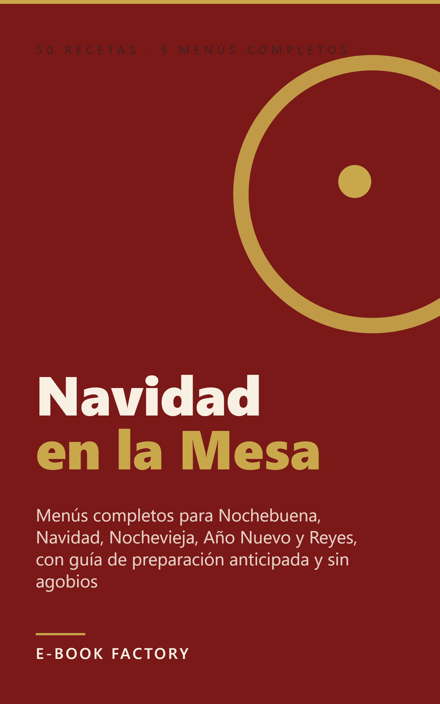

# Revisión humana — EB-000009



| Campo | Valor |
|---|---|
| Título | Navidad en la Mesa: 50 Recetas Españolas y 5 Menús Completos para Toda la Temporada |
| Subtítulo | Menús completos para Nochebuena, Navidad, Nochevieja, Año Nuevo y Reyes, con guía de preparación anticipada y sin agobios |
| Autor | E-Book Factory |
| Idioma / Mercado | es-ES / ES |
| Versión | 1.0 |
| Páginas (PDF 6x9) | 51 |
| Formatos | EPUB, PDF |
| QC | **PASS** (auto: PASS, {'PASS': 24}) |
| Riesgo | LOW  |
| Precio sugerido | 2.99 EUR (ESTIMATE) — Rango de precio dominante en ebooks de cocina en Kindle España (0,99-3,99 €). 2,99 € maximiza conversión para un primer lanzamiento sin reseñas; permite subir a 3,99 € tras acumular valoraciones positivas. Inferior al competidor alemán traducido (>3,99 €), con diferencial de relevancia española. |
| Colecciones | - |

## Descripción

La Navidad española no es una sola noche: son cinco celebraciones en trece días. Nochebuena, el día de Navidad, Nochevieja, Año Nuevo y Reyes se acumulan en el calendario, y organizar la cocina para todo eso puede resultar agotador si no tienes un plan.

Este libro te da el plan.

Dentro encontrarás 50 recetas originales organizadas por tipo de plato: aperitivos y bebidas de bienvenida, sopas y caldos, pescados al horno, carnes asadas, mariscos y frutos del mar, guarniciones, postres y dulces navideños, y especialidades de Reyes. Todo con tiempos reales, pasos claros e ingredientes que encuentras en cualquier mercado español.

Lo que hace diferente a este libro: el último capítulo recoge 5 menús completos, uno para cada celebración, con tabla de platos y guía de preparación anticipada. Sabrás exactamente qué hacer tres días antes, qué dejar para el día anterior y qué preparar el mismo día, para que nada se acumule en el último momento.

Los platos más representativos de la Navidad española están todos aquí: besugo al horno con patatas panaderas, cochinillo asado castellano, cordero lechal, gambas rojas a la plancha, bacalao al pil-pil, croquetas de jamón ibérico, roscón de Reyes tradicional y relleno de nata, polvorones de almendra, turrón de chocolate casero, helado de turrón de Jijona y muchos más.

Para quién es este libro: para quien organiza las comidas familiares en Navidad y quiere llegar a cada fecha con el menú decidido y parte del trabajo ya hecho. No hace falta ser chef. Las recetas están pensadas para cocineros caseros de nivel medio que buscan resultados fiables, no experimentos.

## Keywords

- recetas navideñas españolas
- menú nochebuena paso a paso
- cocina navideña fácil
- roscón de reyes casero
- besugo al horno navidad
- cochinillo asado navidad
- organizar cenas navidad

## Categorías

- Libros Kindle > Gastronomía, cocina y vinos > Cocinas regionales y étnicas > Cocina española
- Libros Kindle > Gastronomía, cocina y vinos > Cocina de temporada y especial > Cocina de Navidad
- Libros Kindle > Gastronomía, cocina y vinos > Libros de cocina > Recetas prácticas

## Warnings / puntos a revisar

- Ninguno

## Archivos

- cover: `design/cover.png`
- cover_jpg: `design/cover.jpg`
- epub: `build/EB-000009_navidad-en-la-mesa-50-recetas-espanolas_v1.0.epub`
- pdf: `build/EB-000009_navidad-en-la-mesa-50-recetas-espanolas_v1.0.pdf`
- Informe QC: `reports/qc_report.md`, `reports/qc_auto.md`
- Informe edición: `reports/editing_report.md`; fact-check: `reports/factcheck_report.md`

## Decisión

```
python factory.py approve EB-000009 --by <SOCIO> [--author "Pen Name"] [--notes "..."]
python factory.py request-changes EB-000009 --by <SOCIO> --restart-at EDIT --notes "qué cambiar"
python factory.py reject EB-000009 --by <SOCIO> --notes "motivo"
```
