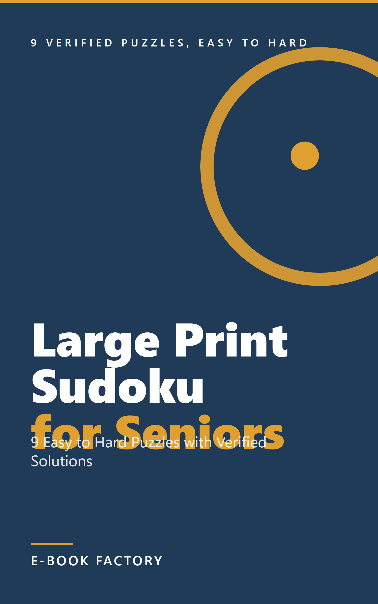

# Revisión humana — EB-000015



| Campo | Valor |
|---|---|
| Título | Large Print Sudoku for Seniors |
| Subtítulo | 9 Easy to Hard Puzzles with Verified Solutions |
| Autor | E-Book Factory |
| Idioma / Mercado | en-US / US |
| Versión | 1.0 |
| Páginas (PDF 6x9) | 27 |
| Formatos | EPUB, PDF |
| QC | **PASS** (auto: PASS, {'PASS': 25}) |
| Riesgo | LOW  |
| Precio sugerido | 6.99 USD (ESTIMATE) —  |
| Colecciones | - |

## Descripción

A short, comfortable sudoku collection in large, easy-to-read print. Nine puzzles move from easy to hard, each one checked by a solver to make sure it has exactly one true solution before going to print, so you never waste time on a flawed grid. A plain-language how-to-solve chapter walks through the one sudoku rule and simple scanning technique for anyone new to the puzzle, and a full solution key sits in the back in the same order as the puzzles, so you can check your work or get unstuck without any guesswork.

## Keywords

- large print sudoku
- sudoku for seniors
- easy sudoku puzzles
- sudoku solutions included

## Categorías

- Puzzles & Games / Sudoku
- Puzzles & Games / Logic & Brain Teasers

## Warnings / puntos a revisar

- Ninguno

## Archivos

- cover: `design/cover.png`
- cover_jpg: `design/cover.jpg`
- epub: `build/EB-000015_large-print-sudoku-for-seniors_v1.0.epub`
- pdf: `build/EB-000015_large-print-sudoku-for-seniors_v1.0.pdf`
- Informe QC: `reports/qc_report.md`, `reports/qc_auto.md`
- Informe edición: `reports/editing_report.md`; fact-check: `reports/factcheck_report.md`

## Decisión

```
python factory.py approve EB-000015 --by <SOCIO> [--author "Pen Name"] [--notes "..."]
python factory.py request-changes EB-000015 --by <SOCIO> --restart-at EDIT --notes "qué cambiar"
python factory.py reject EB-000015 --by <SOCIO> --notes "motivo"
```
