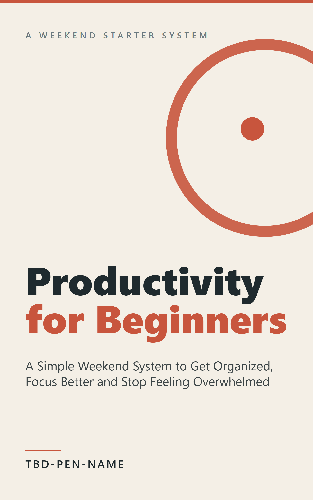

# Revisión humana — EB-TEST-001



| Campo | Valor |
|---|---|
| Título | Productivity for Beginners |
| Subtítulo | A Simple Weekend System to Get Organized, Focus Better and Stop Feeling Overwhelmed |
| Autor | TBD-PEN-NAME |
| Idioma / Mercado | en-US / US |
| Versión | 1.0 |
| Páginas (PDF 6x9) | 26 |
| Formatos | EPUB, PDF |
| QC | **HUMAN_REVIEW** (auto: HUMAN_REVIEW, {'PASS': 25, 'HUMAN_REVIEW': 1}) |
| Riesgo | LOW  |
| Precio sugerido | 2.99 USD (ESTIMATE) — Short (~5,600 words, ~30 pages) beginner ebook in a crowded category; lowest price that typically qualifies for KDP's 70% royalty option (verify the current band). Consider 3.99 if bundled into a series. |
| Colecciones | - |

## Descripción

Feeling busy but scattered? Tried apps, planners and morning routines that never stuck? This short, practical guide helps you build one small productivity system in a single weekend, and keep it running.

Instead of fifty tricks, you will set up four simple parts, one at a time, each with a hands-on exercise:

- Capture: get every task and idea out of your head and into one trusted inbox.
- One list: turn vague worries into clear next actions you can start in minutes.
- Priorities: separate what is urgent from what is truly important, and choose your daily top three.
- Focus: use short, timed work sprints to beat distractions and finally start the tasks you keep postponing.

Then you will add the one habit that keeps everything working: a 30-minute weekly review, with a ready-to-use checklist and a simple way to get back on track when life gets busy.

The ideas come from well-known, time-tested methods, explained in plain language and adapted for people starting from zero. No special app required: a notebook or your phone is enough.

Perfect for anyone who wants to feel calmer, remember everything and spend more time on what matters.

## Keywords

- time management for beginners
- how to get organized
- stop procrastinating
- to do list system
- focus and concentration
- weekly planning
- simple productivity system

## Categorías

- Self-Help > Time Management
- Business & Money > Skills > Time Management
- Self-Help > Personal Transformation

## Warnings / puntos a revisar

- **HUMAN_REVIEW** METADATA/author: 'TBD-PEN-NAME' es provisional: los socios deben decidir el pen name

## Archivos

- cover: `design/cover.png`
- cover_jpg: `design/cover.jpg`
- epub: `build/EB-TEST-001_productivity-for-beginners_v1.0.epub`
- pdf: `build/EB-TEST-001_productivity-for-beginners_v1.0.pdf`
- Informe QC: `reports/qc_report.md`, `reports/qc_auto.md`
- Informe edición: `reports/editing_report.md`; fact-check: `reports/factcheck_report.md`

## Decisión

```
python factory.py approve EB-TEST-001 --by <SOCIO> [--author "Pen Name"] [--notes "..."]
python factory.py request-changes EB-TEST-001 --by <SOCIO> --restart-at EDIT --notes "qué cambiar"
python factory.py reject EB-TEST-001 --by <SOCIO> --notes "motivo"
```
